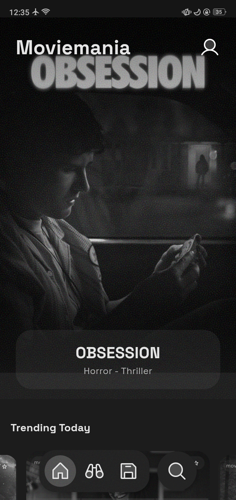
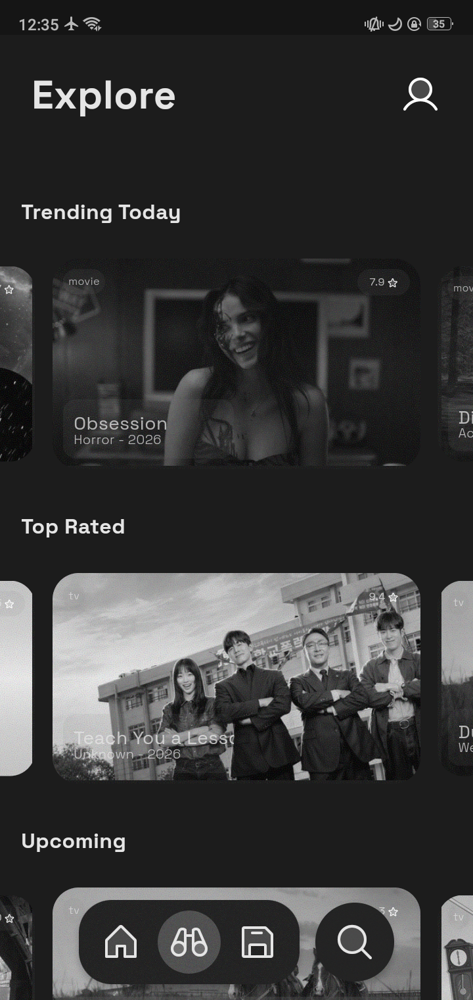

# Moviemania

Movies through a dithered lens.

<p align="center">
  
  &nbsp;&nbsp;&nbsp;&nbsp;
  
</p>

## Setup

1. Create an account at [TMDB](https://www.themoviedb.org/) and generate an API key.

2. Create `lib/api_key.dart`:

   ```dart
   const apiKey = "your_api_key_here";
   ```

## Acknowledgements

- [The Art of Dithering and Retro Shading for the Web](https://blog.maximeheckel.com/posts/the-art-of-dithering-and-retro-shading-web/)
- [Free blue noise textures](https://momentsingraphics.de/BlueNoise.html)
